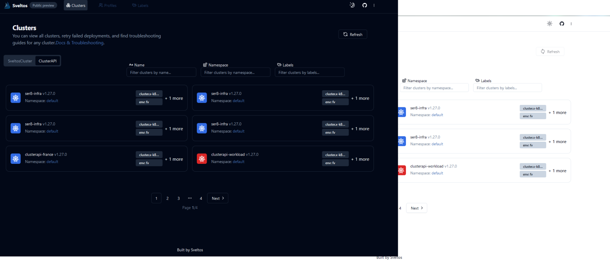

Please refere to sveltos [documentation](https://projectsveltos.github.io/sveltos/).

## What this repository is

This repo contains the source code for Sveltos Dashboard User Interface

## Getting Started Manual installation

to get started with the project, you need to have the following installed on your machine:

- Node.js
- npm
- git
  Next, you can clone the repository and install the dependencies by running the following commands:
- `cd dashboard`
- `npm install` to install project dependencies
- `npm run dev` using Vite to start the development server
- `npm run build` to build the project for production

### Configure the backend port

`set VITE_BACKEND_PORT={port}` before running `npm run dev`
the default backend port is 9000

##### Example :

`set VITE_BACKEND_PORT=8000`

### Configure the backend url (optional)

if sveltos backend is hosted on a different host, you can set the url by running the following command:

`set VITE_APP_BACKEND_URL={url}` before running `npm run dev`

there is no default url.

##### Example :

`set VITE_BACKEND_PORT=8000`

You should have the backend project up and running, please refer to the guide in the [backend repository](https://github.com/projectsveltos/ui-backend) to get started.

### Configure the frontend port

`npm run dev -- --port {port}` to run the project on a different port
if the port is not available , it will automatically switch to the next available port.

##### Example :

`npm run dev -- --port 3000`

## Contributing

❤️ Your contributions are always welcome! If you want to contribute, have questions, noticed any bug or want to get the latest project news, you can connect with us in the following ways:

1. Open a bug/feature enhancement on github 
2. Chat with us on the Slack in the #projectsveltos channel 
3. [Contact Us](mailto:support@projectsveltos.io)

## License

Copyright 2024.

Licensed under the Apache License, Version 2.0 (the "License");
you may not use this file except in compliance with the License.
You may obtain a copy of the License at

    http://www.apache.org/licenses/LICENSE-2.0

Unless required by applicable law or agreed to in writing, software
distributed under the License is distributed on an "AS IS" BASIS,
WITHOUT WARRANTIES OR CONDITIONS OF ANY KIND, either express or implied.
See the License for the specific language governing permissions and
limitations under the License.
